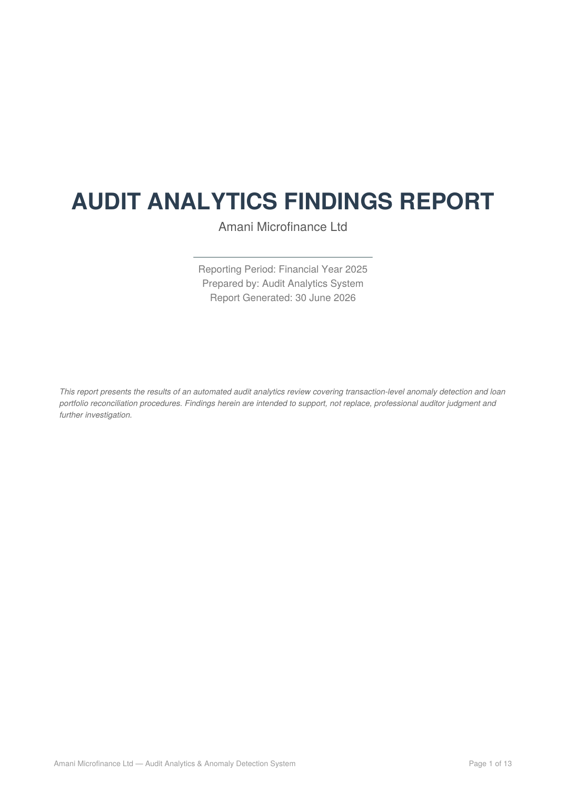
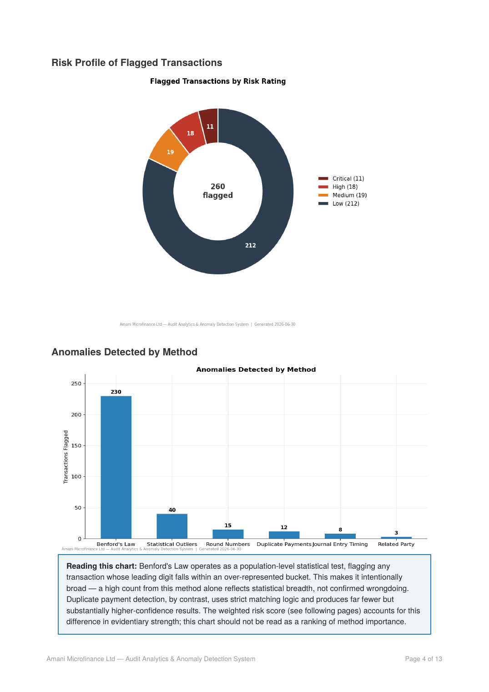
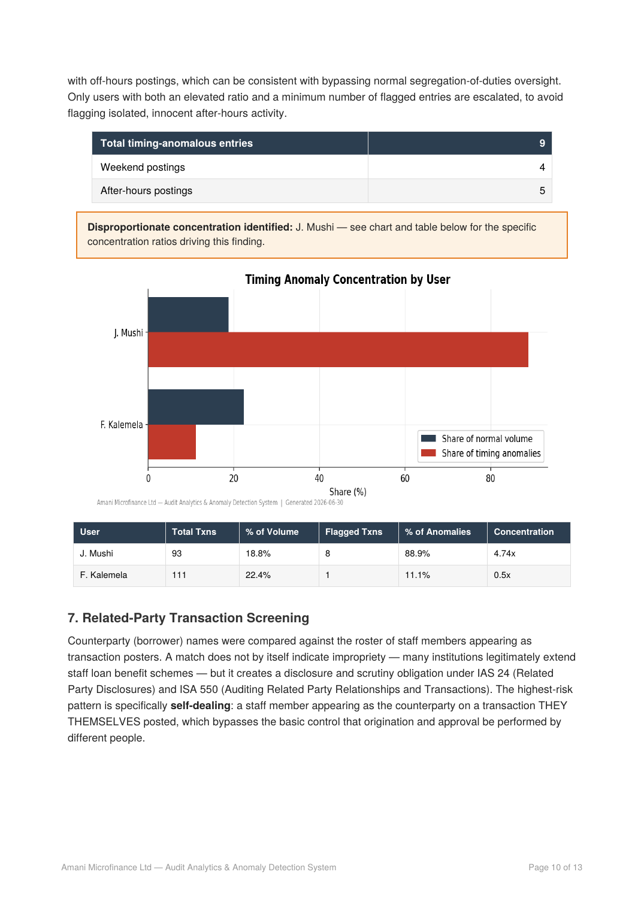
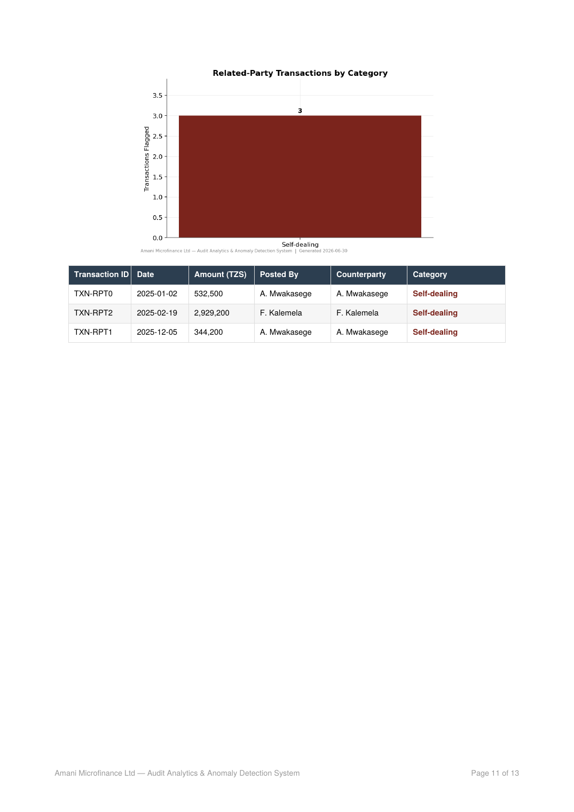

# Audit Analytics & Anomaly Detection System

An automated audit analytics toolkit that ingests a financial institution's transaction data, applies seven independent fraud and error detection procedures, combines the results into a single weighted risk score per transaction, and generates a complete, audit-grade PDF findings report — modeled on a fictional microfinance institution, **Amani Microfinance Ltd**.

Built to demonstrate the combination of accounting/audit domain knowledge with applied data analytics — the kind of toolkit a Big 4 audit analytics team would build internally.

> **Note:** Amani Microfinance Ltd is a fictional company created for this project, with a synthetic transaction dataset containing deliberately planted anomalies used to validate every detection procedure end to end.

---

## What it does

Running a single command against a transaction CSV produces:

- **Seven independent detection procedures**, each grounded in real audit methodology
- **One weighted risk score per transaction** (0–100), combining corroborating evidence across methods with financial materiality
- **A complete PDF audit report** — cover page, table of contents with clickable bookmarks, executive summary, detailed per-method findings, and a methodology/limitations appendix
- **CSV exports** of consolidated and risk-scored findings for further analysis
- **101 passing automated tests**

```bash
python run_full_audit.py
```
…and the full report, charts, and CSVs land in `output/`.

## Sample output

| Cover Page | Executive Summary |
|---|---|
|  |  |

| Journal Entry Testing | Related-Party Screening |
|---|---|
|  |  |

On the demo dataset (496 transactions, 37 loan accounts), the toolkit flags 260 transactions across all procedures, with 11 reaching Critical risk and 18 High — representing TZS 44.1M in combined exposure — alongside 2 possible ghost loans identified through reconciliation.

## Detection procedures

| # | Procedure | Audit standard / methodology |
|---|---|---|
| 1 | **Benford's Law digit-frequency analysis** | Chi-square goodness-of-fit + Nigrini's Mean Absolute Deviation (MAD); flags sample sizes below the reliable threshold (n≈300) automatically |
| 2 | **Duplicate payment detection** | Fuzzy matching on counterparty + account + amount within a configurable date window |
| 3 | **Round-number transaction screening** | Tiered roundness classification (10K → 1M+), risk-weighted by how round the amount is |
| 4 | **Statistical outlier detection** | Modified z-score (median/MAD, robust to skew) as default, with IQR and classic z-score for comparison — computed *within* each account type to avoid cross-contamination |
| 5 | **Journal entry testing** | Weekend/after-hours posting detection (ISA 240) plus user concentration ratio analysis — distinguishes a busy officer's natural volume from genuine disproportionate concentration |
| 6 | **Related-party transaction screening** | Exact and fuzzy name matching against the staff roster (IAS 24 / ISA 550); separates confirmed self-dealing from milder disclosure-only matches |
| 7 | **Loan portfolio reconciliation** | GL-derived balances vs. the loan management system's supporting schedule, classified into clean tie-outs, timing differences, material variances, unsupported GL balances, and possible ghost loans |

### Weighted risk scoring

Every flagged transaction receives a score reflecting **likelihood × materiality** (ISA 315-aligned risk-of-material-misstatement framing): a confirmed identity match (related-party self-dealing) outweighs a single Benford digit-bucket flag, and a transaction's size relative to its account's typical activity scales the final score. Raw scores are proportionally rescaled (not hard-clipped) so genuinely different transactions don't pile up at an artificial ceiling.

## Tech stack

Python · pandas · NumPy · SciPy · Matplotlib · ReportLab · pytest

## Project structure

```
audit_analytics/
├── modules/                      # Core detection & reporting engine
│   ├── data_loader.py            # Ingestion & validation
│   ├── benford_analysis.py
│   ├── duplicate_detector.py
│   ├── round_number_detector.py
│   ├── outlier_detector.py
│   ├── journal_entry_tester.py
│   ├── related_party_detector.py
│   ├── reconciliation_engine.py
│   ├── risk_scoring_engine.py
│   ├── chart_style.py            # Shared visual identity across all charts
│   ├── summary_visuals.py        # Executive-summary level charts
│   └── pdf_report_generator.py   # ReportLab-based PDF assembly
├── data/                         # Demo dataset generators + generated CSVs
├── tests/                        # 101 pytest tests (unit + integration)
├── output/                       # Generated reports, charts, CSVs
├── run_full_audit.py             # Orchestrates the full pipeline end to end
├── requirements.txt
└── pytest.ini
```

## Getting started

```bash
pip install -r requirements.txt
python data/generate_demo_data.py        # generates the transaction dataset
python data/generate_loan_portfolio.py   # generates the loan GL + schedule
python run_full_audit.py                 # runs everything, produces the PDF
pytest                                    # runs the full test suite
```

## Engineering notes

A few real bugs were found and fixed during development by validating against actual output rather than trusting that code "ran without error" — documented here because the debugging process is as much a part of this project as the features:

- **Outlier false-positive rate (24% → 8%):** the original demo data generator drew transaction amounts from one flat distribution regardless of account type, making the "normal" baseline population unrealistically dispersed. Fixed by giving each account type a realistic, clustered typical range.
- **Risk score pile-up at the ceiling:** hard-clipping each transaction's score at 100 caused unrelated transactions to tie at the maximum, because the outlier flag and the materiality multiplier are correlated (both measure distance from a typical account size). Fixed by rescaling the whole score distribution proportionally instead of clipping per-transaction.
- **PDF blank page / orphaned headings:** an explicit page break combined with content that already overflowed naturally produced a stray blank page; later, a section heading could render with nothing underneath it if upstream data was incomplete. Both fixed by mirroring each section's actual rendering condition exactly, and verified by rendering every page to an image and inspecting it — not just checking the PDF built without error.
- **Fuzzy name-matching threshold:** a realistic single-character typo ("Alise" vs "Alice") scored exactly 0.80 similarity under `difflib`, just under the initial 0.82 cutoff — recalibrated to reliably catch genuine minor data-entry variants.

## Testing

```bash
pytest
```
101 tests across unit tests (isolated logic on small synthetic data) and integration tests (the real pipeline against the actual demo dataset, locking in known planted-anomaly counts so future changes can't silently break detection).

## Roadmap

- [x] Core detection engine (Benford, duplicates, round-numbers, outliers, reconciliation)
- [x] Weighted risk scoring
- [x] PDF audit report generation
- [x] Journal entry testing & related-party screening
- [ ] Interactive Streamlit dashboard
- [ ] AI-generated findings narrative

## Author

Derick — BCom Accounting (Audit), University of Dar es Salaam Business School · CPA Intermediate (NBAA) · ACCA in progress
